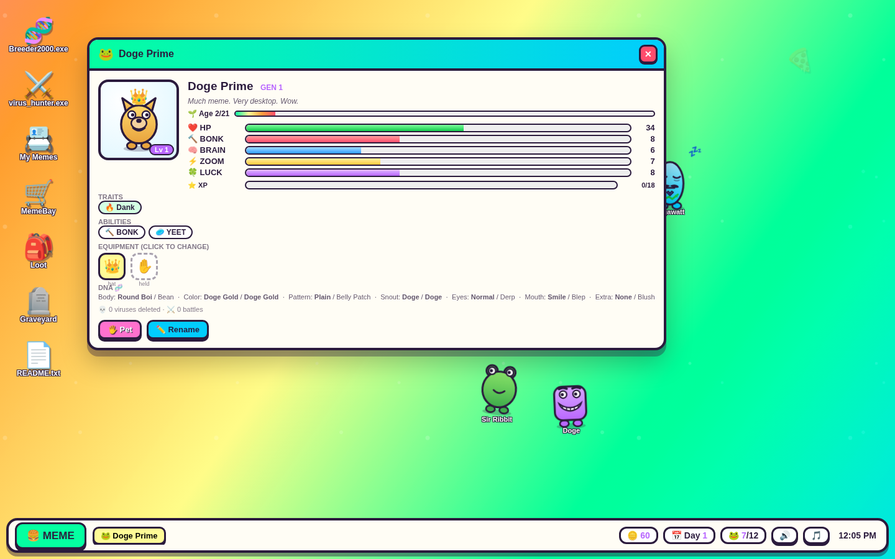
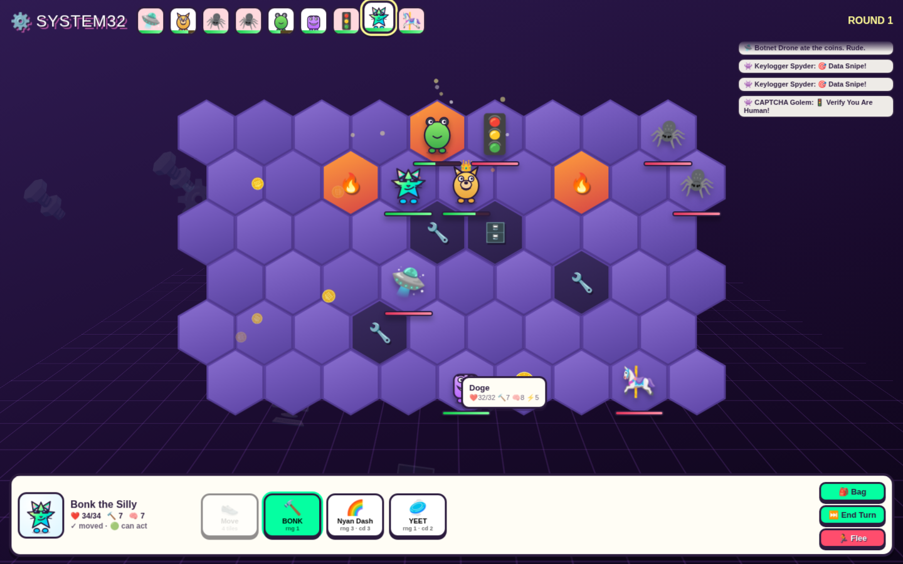

# 🧬 MEME-GENICS

**Breed memes. Delete viruses. Repeat until your desktop is safe.**

A loving, extremely goofy parody of *Mewgenics*-style breeding-tactics games — except instead of
cats in a house, you manage **memes living on a fake desktop OS**, and instead of monsters you fight
**evil computer viruses** on a hex grid.

No build step, no dependencies, no assets — everything (sprites, sounds, particles) is generated
in the browser. Just open `index.html`.





## ▶️ How to play

```bash
# option 1: just open it
open index.html

# option 2: serve it
python3 -m http.server 8000   # then visit http://localhost:8000
```

## 🐸 The loop

1. **Live** — memes wander your desktop. Click to pet, double-click for stats, drag to yeet.
2. **Breed** — `Breeder2000.exe` fuses two adult memes. Kids inherit **one allele per gene from
   each parent** (7 genes: body, color, pattern, snout, eyes, mouth, extra), the dominant allele
   shows, stats blend with a lucky drift, traits pass down, and mutations sneak in rare genes
   (RAINBOW color! LASER eyes! halos! horns!). Breeding related memes makes a **Reposted** baby. Ew.
3. **Fight** — `virus_hunter.exe` sends up to 4 memes into hex-grid turn-based tactics against
   Pop-Up Ads, Trojan Ponies, Ransom-Where, Crypto Miners and bosses like the CAPTCHA Golem,
   B.S.O.D. and **THE SPAM KING**.
4. **Grieve** — memes age one day per mission/nap and eventually go stale forever. Memes that die
   in battle are **permanently dead** (Mewgenics rules) — unless you burn Copium mid-fight or pay
   the Graveyard to **necropost** them back as zombies.
5. **Optimize the bloodline** — the memes die; the *genes* are forever. Stack Gigachad + Dank +
   Big Brain across generations and build the perfect super-meme.

## ⚔️ Combat cheat sheet

| Stat | Does |
|---|---|
| ❤️ HP | don't let it reach 0 |
| 🔨 BONK | physical ability damage |
| 🧠 BRAIN | fancy ability damage & healing |
| ⚡ ZOOM | turn order + movement range |
| 🍀 LUCK | crit chance, stun chances, Thoughts & Prayers |

Every meme knows **BONK** plus a signature ability from its snout gene (Doge → YEET,
Frog → Touch Grass, Catto → Nyan Dash, Troll → Rickroll, Stonks → STONKS, Chad → Ban Hammer,
Spooky → UNO Reverse) plus up to two heritable "spice" abilities — Deep Fry, Copypasta,
Vibe Check, MLG Airhorn, Cheemsburbger, GG EZ and more.

Watch for hazard tiles (🔥), loot tiles (🪙), knockback yeets, and the CAPTCHA Golem's
every-other-round invulnerability.

## 🛒 Also featuring

- **MemeBay™** — daily rotating stock of hats (+stats, visible on your meme!), held items and consumables
- **Scam pop-ups** — close them for coins, or "CLAIM YOUR PRIZE" and find out
- **Random events** — stray meme adoptions, STONKS market days
- **Autosave** to localStorage; New Game from the 🍔 MEME start menu

*A parody. No cats were harmed. Several viruses were.*
