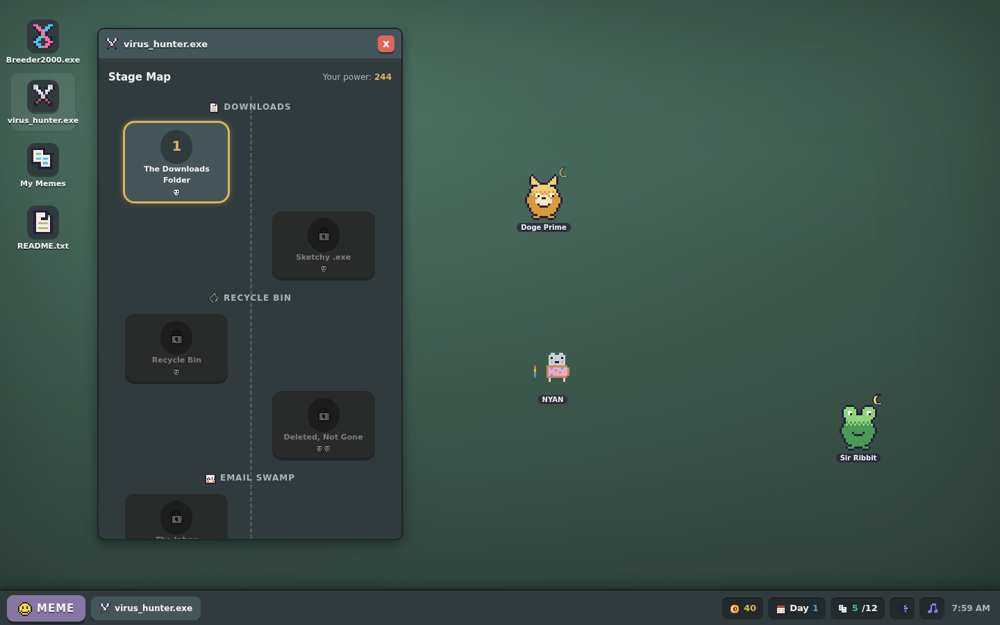

# MEME-GENICS

**Breed a bloodline of memes. Send them to delete viruses. Lose them. Breed better ones.**

A goofy parody of *Mewgenics*: **defend your PC from viruses.** You're a malware tester — raise
**memes on a fake full-screen desktop OS**, breed them across generations for stats and **D&D
classes**, then **insert an infected flash drive** to run a stage and fight the viruses in a
**cinematic anime auto-battler** where your timing decides the fight. Hand-drawn pixel art, no build
step, no dependencies, no asset files — every sprite, icon, sound and particle is generated in the
browser. Just open `index.html`.





## How to play

```bash
open index.html
# or: python3 -m http.server 8000   →  http://localhost:8000
```

## The loop

0. **Start** — a **title screen** greets you; hit **PLAY** to drop onto your cozy desktop.
1. **Get memes** — new memes come from **MemeBay**, a fake shopping site (with ads): buy **meme
   packs** and **rip them open** for a random meme with a **rarity** (Common → Legendary). Higher
   rarities mean better stats, guaranteed traits, and rarer species — including **tamed enemies**
   (Trojan, Spyder, Drone, Wormie) that fight for you.
2. **Breed** — fuse two adults in `Breeder2000.exe`. Fusing lays an **egg that incubates in real
   time** on your desktop — **tap the egg to speed up hatching** — while both parents are **busy
   breeding and can't fight** until they've rested (watch it all in the **Breeding** folder). Kids
   inherit one allele per gene from each parent (dominant shows) — **body shape, size**, color,
   class, up to two learned skills, traits — and can mutate rare genes. **Breeding for stronger
   stats is the whole strategy.**
2. **Grow** — babies grow into fighters after their first battle (or a little time / a few pets).
3. **Fight** — pick a stage on the **map**, choose up to 4 memes, and **insert the infected flash
   drive** to begin.
4. **Unlock skills** — clearing a stage drops a **Skill Card Pack**: **rip it open** and **drag**
   each of the 4 cards — real TCG-style cards — onto a meme. Some are new combat skills, others are
   common **stat-ups / passives**. Memes start with only a Basic Strike and hold **2 skills max**
   (a new skill can replace an old one).
5. **Retire** — every meme has **5 stages of energy** (shown as a bar). Spend it all and the meme
   **retires** (breed only), so you must keep breeding fresh fighters. Retired memes attract
   **online adopters** who DM you to buy them for **free coins**. Fallen memes are permanently dead
   (necropost or Copium excepted).

## Combat — cinematic auto-battler + 20 skill mini-games

Fights play out automatically by **ZOOM** (speed) order across themed **zone** battlefields with
parallax backdrops and a glowing horizon. Memes **run up, leap and spin** into **mid-air clashes**
(with a freeze-frame on impact), **dodge** attacks with an afterimage, and the camera zooms and pans
to the action while hits kick up dust, rings and screen shake. A live **team tracker** shows your
memes' health the whole time. You jump in with skill through **20 distinct mini-games** — every
attack and parry feels different:

- **STRIKE / TRACER / QUICKDRAW** — timing games: stop the marker, catch the bolt, wait then strike.
- **MASH / OVERLOAD / FLURRY** — button-hammering: fill the bar, out-mash the decay, alternate keys.
- **BULLSEYE / PULSE / COMBO / ZEN** — shrinking-ring timing for hits and heals.
- **REACTION / SEQUENCE / RHYTHM** — counters, memorised input chains, tap-on-the-beat.
- **AIM / DODGE / WHACK / SPINNER / STOPWATCH / CATCH / BALANCE** — click, weave, purge and more.

Nail them for bonus damage and *perfect* parries (which reflect). Do nothing and it still
auto-resolves — but skill matters. Each stage shows **your power vs enemy power** and its
**rewards** before you commit.

## The memes

Classic types (Doge, Frog, Catto, Troll, Stonks, Chad, Spooky) plus **brainrots** with their own
pixel models and specials: **Nyan Cat**, **Tung Tung Tung Sahur**, **Tralalero Tralala** (the
shark), **Bombardiro Crocodilo**, and **Cappuccino Assassino**. Each type has a combat role and a
signature special (nuke, AoE, multi-hit, heal, buff, debuff or shield).

## Classes, Index & customization

- **12 D&D classes** — Fighter, Mage, Cleric, Rogue, Ranger, Paladin, Barbarian, Druid, Bard,
  Necromancer, Wizard, Monk. Each grants stat mods, a guaranteed **unique class ability**, and a
  passive (Fighter shrugs off damage, Cleric mends the team, Rogue crits more, Paladin starts
  shielded, Necromancer drains life, and more). Classes are inherited when you breed.
- **Meme Index** — a collection dex of every meme type, virus and move; entries unlock as you
  discover them.
- **Customize PC** — swap desktop wallpaper themes.

## Progression

You start with just breeding and the first stage. **MemeBay** (shop), your **Loot Stash**, the
**Graveyard** (necropost), and the endless **Cloud** unlock as you climb the stage map toward the
**Spam King** and beyond.

## Under the hood

- **Pixel art** — `js/pixel.js` renders tiny character grids to cached canvas data-URLs
  (`image-rendering: pixelated`). Meme sprites are generated from each meme's genotype, so children
  visibly inherit their parents' looks; brainrots use hand-drawn full-body sprites.
- **One muted palette, used as information.** Embossed panels, felt background, physical juice.
- **No emoji, no external assets, no build step.** Everything is self-contained.

*A parody. No cats were harmed. Several viruses were.*
